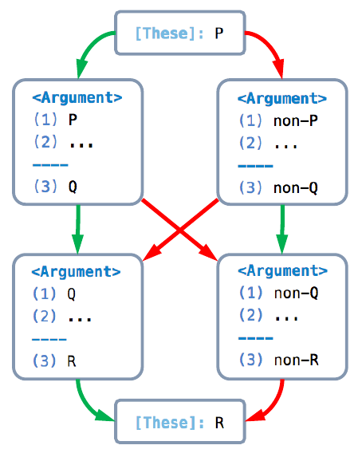
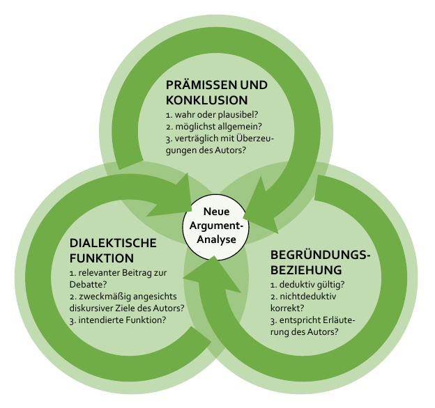

# Notizen zu Betz - Argumente Analysieren & Sitzung 02.4.

Debatte --> Gründe --> Argumente

Es ist notwendig sich etwas von der Textgrundlage zu entfernen um zu differenzieren. Unterscheiden, präzisieren, reformulieren.

Logisch-semantische Analyse (17): Umschreibung in seperater definition an anderem Ort??

exegetisch: Nahe am Text eine kohärente Argumentation entwickeln
Systematisch: Fragen an den Text herantragen

## Frage 2: Sollen solche Antizipierten gegeneinwände wie auf Tafel 12 wirklich eingeführt werden?

## Frage 4: Die Sache mit dem Untergraben von Argumenten…
<_ kommt nicht vor?

## Anmerkung 2: definition von angreifen fasst Kontradiktorische Beziehung von Argumenten nicht auf: ><

## Frage 5: Unterschied Betz - Unser Seminar: rekonstruktiver Deduktivismus?
Bei uns müssen ja nicht alle Argumente deduktiv gültig sein. oder?

## Anmerkung 3: _höchstens wenn_ , _nur wenn_ , Konjunktion
Tafel 34 reduziert die formulierung _höchstens dann, wenn_ auf eine Äquivalenz. Formulierung ist für mich verwirrend.

## Frage 8: Dürfen Prämissen vorheriger Argumente einfach einbezogen werden?
In Tafel 35 werden einfach Prämissen importiert…

## Anmerkung 4: x zu y
Zur besseren Verständlichkeit würde ich in der Konklusion (3) (Ex): Gx x mit y ersetzen. (S. 43)

