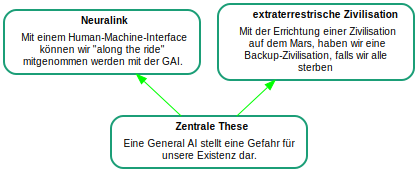

---
title:
- Elon Musk zur KI
author:
- Sebastian Flick
- Claude Aebersold
theme:
- Copenhagen
bibliography: 
- bibliothek_musk_Argumentationsanalyse.bib
---

# Elon Musks Punkte zu Künstlicher Intelligenz
Die Künstliche Intelligenz (KI) gewinnt zunehmend an Wichtigkeit in unserer Gesellschaft.

Viele Personen aus der Politik, Industrie und Akademie haben sich dazu geäussert. Neben Proponenten der KI gibt es auch sehr kritische Ansichten, die eine oft dystopische Zukunft voraussagen. Eine prominente Person, die eine kritische Position zu KI vertritt und uns auch auf mögliche Gefahren hinweist, ist Elon Musk.

# Textgrundlage

Grundlage zu unserer Argumentationsanalyse sind folgende Dokumente:

---
nocite: |
  [@fridmanNeuralinkAIAutopilot]
  [@jackmaWorldArtificialIntelligence2019]
  [@muskFutureWeRe]
  [@russellResearchPrioritiesRobust2015]
  [@AIReallyThreat]
...
\tiny
::: {#refs}
:::
\normalsize

# Erkenntnisinteresse

Wir versuchen, aus verschiedenen Quellen Elon Musks eine kohärente Argumentation zu den Gefahren und Chancen der KI zu rekonstruieren und überprüfen die Stichhaltigkeit seiner Argumente.

- Thematik und Gefahren der Generellen KI besser einordnen und evaluieren können.
- Legitimität von Elon Musk untersuchen.
- Argumente aus verschiedenen Quellen rekonstruieren können.
- Argdown benützen lernen.

# Zentrale These

Die Generelle KI bringt Gefahren mit sich. Deshalb ist es wichtig, die Entwicklung stark zu kontrollieren und die Verwendung einzuschränken.

# Fragen / Herausforderungen
Wie, wenn überhaupt, verwenden wir Quellen, die nicht vom Autoren direkt stammen, die er aber unterstützt?

- Können wir den Open Letter verwenden?
- Biografie von Musk?

